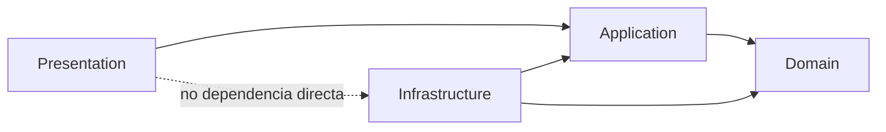
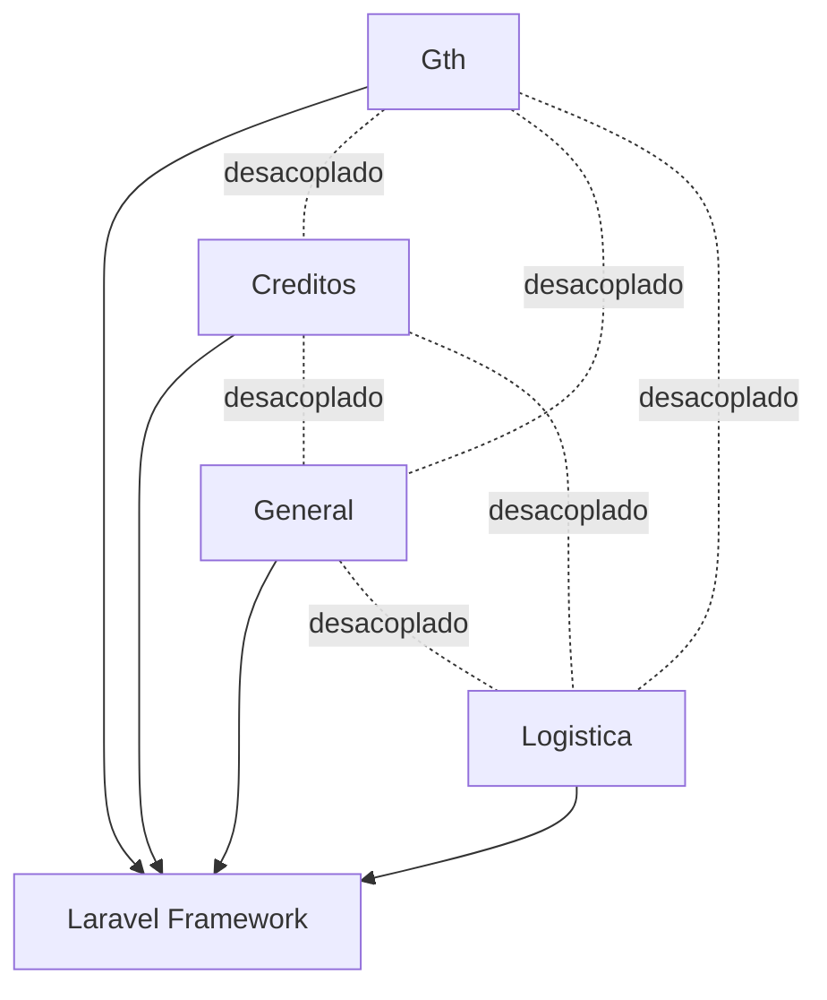

# Arquitectura Modular Clean (Laravel)

## Objetivo
Esta base implementa una arquitectura modular desacoplada para `Gth`, `Creditos`, `General` y `Logistica`, aplicando Clean Architecture con limites explicitos entre capas:

- `Presentation`: controladores y vistas.
- `Application`: casos de uso.
- `Domain`: entidades y contratos (interfaces).
- `Infrastructure`: adaptadores y wiring de dependencias.

## Estructura por modulo
Cada modulo mantiene su propia estructura y responsabilidades:

```text
modules/{Modulo}/
├── Application/
│   └── UseCases/
├── Domain/
│   ├── Contracts/
│   └── Entities/
├── Infrastructure/
│   ├── DependencyInjection/
│   ├── Persistence/
│   └── Providers/
└── Presentation/
    ├── Controllers/
    ├── Routes/
    └── Views/
```

## Diagrama de dependencias por capas


## Diagrama entre modulos


## Inversion de dependencias aplicada
Cada caso de uso depende de un contrato del dominio y no de implementaciones concretas:

- `Domain\Contracts\*Repository` define el contrato.
- `Application\UseCases\*UseCase` consume el contrato.
- `Infrastructure\Persistence\Config*Repository` implementa el contrato.
- `Infrastructure\DependencyInjection\*ModuleDependencies` realiza los bindings.

## Gestor de dependencias por modulo
Cada modulo incluye su propio gestor:

- `Modules\Gth\Infrastructure\DependencyInjection\GthModuleDependencies`
- `Modules\Creditos\Infrastructure\DependencyInjection\CreditosModuleDependencies`
- `Modules\General\Infrastructure\DependencyInjection\GeneralModuleDependencies`
- `Modules\Logistica\Infrastructure\DependencyInjection\LogisticaModuleDependencies`

Estos gestores son invocados por su `ServiceProvider` de modulo.

## Configuracion especifica por modulo
Se definio configuracion independiente para cada modulo:

- `config/modules/gth.php`
- `config/modules/creditos.php`
- `config/modules/general.php`
- `config/modules/logistica.php`

Cada provider hace `mergeConfigFrom(...)` contra su namespace `modules.{modulo}`.

## Endpoints base de la nueva arquitectura
Para cada modulo se exponen endpoints de referencia:

- `GET /clean/gth/context` y `GET /clean/gth/ui`
- `GET /clean/creditos/context` y `GET /clean/creditos/ui`
- `GET /clean/general/context` y `GET /clean/general/ui`
- `GET /clean/logistica/context` y `GET /clean/logistica/ui`

Estos endpoints sirven como punto de entrada para migrar gradualmente funcionalidades legacy.

## Tests unitarios independientes por modulo
Se agregaron pruebas unitarias por modulo en:

- `tests/Unit/Modules/Gth`
- `tests/Unit/Modules/Creditos`
- `tests/Unit/Modules/General`
- `tests/Unit/Modules/Logistica`

Adicionalmente, `phpunit.xml` incorpora testsuites dedicados para ejecutar cada modulo de forma aislada.

## Guia de implementacion para nuevos desarrollos
1. Crear entidad y contratos en `Domain`.
2. Crear caso de uso en `Application`.
3. Implementar adaptador en `Infrastructure/Persistence`.
4. Registrar binding en `Infrastructure/DependencyInjection`.
5. Exponer entrada HTTP en `Presentation` (controller + route + view).
6. Añadir configuracion del modulo en `config/modules/{modulo}.php`.
7. Escribir test unitario del caso de uso en `tests/Unit/Modules/{Modulo}`.

## Estrategia de migracion recomendada
1. Mantener rutas/controladores legacy activos.
2. Migrar funcionalidad por funcionalidad al modulo Clean correspondiente.
3. Reemplazar llamadas de Eloquent directas por repositorios de dominio.
4. Mover validaciones y reglas de negocio a casos de uso.
5. Retirar controladores legacy al completar cobertura funcional.
